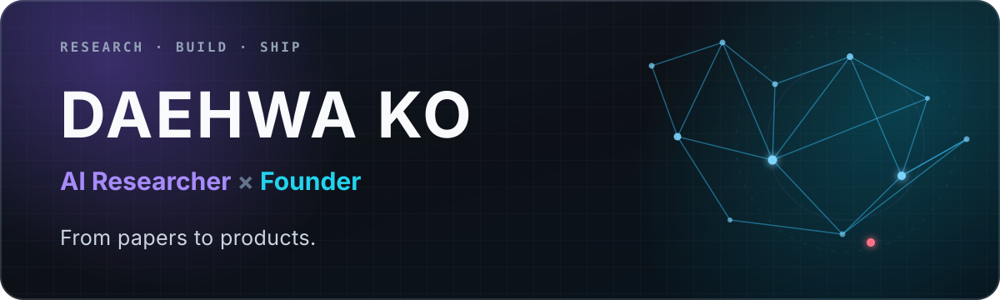

  

  <a href="#selected-research">Research</a>&nbsp;&nbsp;·&nbsp;&nbsp;
  <a href="https://play.google.com/store/apps/details?id=app.braveidiots.glowme">GlowMe AI</a>&nbsp;&nbsp;·&nbsp;&nbsp;
  <a href="https://www.youtube.com/channel/UCyajG8EDAbtXdgvWQwurVqw">YouTube</a>&nbsp;&nbsp;·&nbsp;&nbsp;
  <a href="mailto:daehwa001210@gmail.com">Email</a>

  I explore ambitious AI ideas, turn them into working systems, and ship the ones that matter.

## Now

- **CEO & Co-Founder · [GlowMe AI](https://apps.apple.com/kr/app/glowme-ai-styling/id6755821428)** — building AI-powered beauty and styling experiences.
- **M.S. Researcher · Artificial Intelligence** — Korea Aerospace University, QAI Lab.
- **Current focus** — efficient learning, adversarial robustness, reinforcement learning, and useful AI products.

## Selected Research

<table>
  <tr>
    <td width="145"><strong>AISTATS 2026</strong></td>
    <td>
      <a href="https://openreview.net/forum?id=cMQ9GE4msQ"><strong>TESLA: Taylor Expansion of Sinusoidal Learnable Activations</strong></a> 
      Daehwa Ko, JaeHyeon Kim, SeungHyun Ham, Jay Hoon Jung · <a href="https://github.com/KAU-QuantumAILab/TESLA">Code</a>
    </td>
  </tr>
  <tr>
    <td width="145"><strong>NeurIPS 2024</strong></td>
    <td>
      <a href="https://proceedings.neurips.cc/paper_files/paper/2024/file/9e770fcdb456400325c11d58b3a04d08-Paper-Conference.pdf"><strong>Amnesia as a Catalyst for Enhancing Black Box Pixel Attacks in Image Classification and Object Detection</strong></a> 
      Dongsu Song, Daehwa Ko, Jay Hoon Jung · <a href="https://github.com/KAU-QuantumAILab/RFPAR">Code</a>
    </td>
  </tr>
</table>

## Selected Builds

<table>
  <tr>
    <td width="33%" valign="top">
      <h3><a href="https://github.com/daehwa00/paper-workspace">paper-workspace</a></h3>
      
A self-hosted LaTeX workspace with PDF preview, SyncTeX, live collaboration, and optional AI revision proposals.

      JAVASCRIPT · RESEARCH TOOLING
    </td>
    <td width="33%" valign="top">
      <h3><a href="https://github.com/daehwa00/gpulse">gpulse</a></h3>
      
A polished live terminal pulse monitor for NVIDIA GPUs, designed for remote machines over SSH.

      PYTHON · GPU TOOLING
    </td>
    <td width="33%" valign="top">
      <h3><a href="https://github.com/daehwa00/Design_Airfoil_with_RL">Design Airfoil with RL</a></h3>
      
Reinforcement learning for engineering-driven airfoil shape optimization and simulation.

      PYTHON · REINFORCEMENT LEARNING
    </td>
  </tr>
</table>

## Working Across Research & Product

<table>
  <tr>
    <td width="50%" valign="top">
      <h3>Research</h3>
      
Activation functions, adversarial robustness, reinforcement learning, computer vision, and AI for engineering.

    </td>
    <td width="50%" valign="top">
      <h3>Product</h3>
      
End-to-end AI systems, mobile experiences, developer tools, and translating prototypes into products people can use.

    </td>
  </tr>
</table>

<strong>More publications, experience & awards</strong>

### Additional Publications

- **Shape Optimization of Airfoils Based on Reinforcement Learning** — Korean Society for Aeronautical & Space Sciences Spring Conference 2025 · Outstanding Presentation Paper Award.
- **Confidence-independent Adversarial Attacks with Reinforcement Learning and Image Patching** — KICS Summer Conference 2024.
- **VoiceKey: Real-time Compression Encoding and Quantization for Voice Authentication Model on Edge Devices** — The 4th Korea Artificial Intelligence Conference.

### Experience

- **GlowMe · CEO & Co-Founder** — 2024.09–Present.
- **QAI Lab · Researcher** — 2021.12–Present.
- **LG Discovery Lab Seoul · Youth AI Educator** — 2024.03–2025.09.
- **BRAVE · Representative** — 2023.04–2023.12; developed an AI-assisted domestic-violence prevention service with Ilsan East Police Station.
- **Deeperent · President** — led Korea Aerospace University's deep-learning club and mentored project teams.

### Selected Awards

- Excellence Award — SNU SNaaC Re:Pit Acceleration Program, 2025.
- Recognition — Goyang IR Day, 2025.
- Grand Prize — KAU AI Drone Racing, 2024.
- Grand Award — KAU Gen.AI Business Hackathon, 2024.
- Special Award — SW-Centered University Joint Hackathon, 2023.
- Best Award — ICT Startup Makeathon, 2023.
- 1st Place — KAU Hackathon, 2023.

### Education

- **M.S. in Artificial Intelligence**, Korea Aerospace University — 2024–Present.
- **B.S. in Software & Mechanical Engineering**, Korea Aerospace University — 2020–2024.

## Toolkit

`Python` · `PyTorch` · `CUDA` · `Docker` · `ROS 2` · `Isaac Sim` · `Unity` · `TypeScript` · `React` · `Next.js` · `Node.js` · `Three.js`

 

  <strong>Research deeply. Build boldly.</strong> 
  Seoul, Republic of Korea · <a href="mailto:daehwa001210@gmail.com">Let's talk</a>

